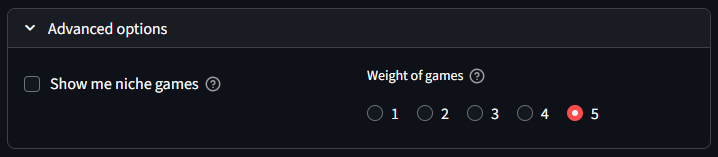

# MeepleMatch

MeepleMatch is a board game recommender based on Collaborative Filtering. It uses BoardGameGeek's (BGG) database of games and users.  
Enter your BGG username, set your preferences, and receive personalized game suggestions based on what you and similar users have rated.


## 🧮 Objectives

- Help users discover new board games based on their taste  
- Use similarity between users to drive recommendations  
- Allow filters like complexity (weight), and niche *vs.* mainstream games  
- Present intuitive visualizations: rating distributions, overlap with other users, most rated games, etc.


## 🗂️ Data Acquisition

The data was taken from [Kaggle](https://www.kaggle.com/datasets/threnjen/board-games-database-from-boardgamegeek?select=games.csv). The original dataset includes 9 files, but this project only uses [`games.csv`](data/games.csv) and [`user_ratings.csv`](data/user_ratings.csv), both of which are included in this repository and are **needed** to run the app.


## 🛠️ Installation & Setup

1. Clone the repository  
   ```bash
   git clone https://github.com/arnaurr94/MeepleMatch.git
   cd MeepleMatch

2. (Optional but recommended) Create a Python virtual environment
    ```bash
    conda create -n env_name python=3.13.5
    conda activate env_name

3. Install required dependencies
    ```bash
    pip install -r requirements.txt

4. Run the application locally
    ```bash
    streamlit run meeplematch.py

## 📱 How It Works

- **User Input:** \
Provide a BGG username + number of recommendations.

    

- **(Optional) Set Advanced options:**  
Whether to include niche games and/or weight filtering.

    

- **Data Gathering:** \
Scrapes BGG for the user’s ratings. Displays a brief summary of user ratings: games they have rated and a distribution of their scores.

    

- **Similarity Computation:** \
Compares with an existing dataset of users. Identifies users who share a minimum number of games with the user; compute similarity.
 
- **Filtering:** \
Removes games the user already rated. If selected, filter by popularity and/or complexity.
 
- **Scoring & Recommendation:** \
Computes weighted scores for unplayed games based on similar users’ ratings and gets the top *N* (for number of recommendations selected).\
Displays a table of game covers and titles that link to the corresponding BGG page.

    

- **(Extra) Visualization:** \
Presents charts and metrics of the recommending process: How many users were compared, the user's top 5 most rated games by the community and a histogram of games shared with the community.

    <div style="display: flex; gap: 5px;">
        
        
    </div>


## 🌐 Deployment

If you prefer not to run the application locally, MeepleMatch is also available via a public Streamlit [deployment](https://meeplematch.streamlit.app/). Or by scanning this QR code:


## 🔜 Future improvements

- **Full rating history support:**  
  Due to scraping limitations on BoardGameGeek (BGG), only ≤ 300 games rated games per user are currently retrieved. Future versions will aim to support complete user rating histories.

- **Dataset update:**  
  The current dataset was collected approximately four years ago. An updated version will be introduced to reflect recent game releases and community ratings, ideally through BGG’s XML API when accessible.

- **Edition consolidation:**  
  Different editions of the same board game are currently treated as separate entries. A normalization process will be implemented to merge these and prevent duplicate recommendations.

- **Advanced filtering options:**  
  Planned features include additional filters for game **genre**, **player count**, and **playing time**, allowing for more personalized recommendations.

- **Deployment improvements:**  
  The current Streamlit deployment struggles with users with ~10 rated games and may crash. Planning to redeploy on Azure for better performance and reliability.

